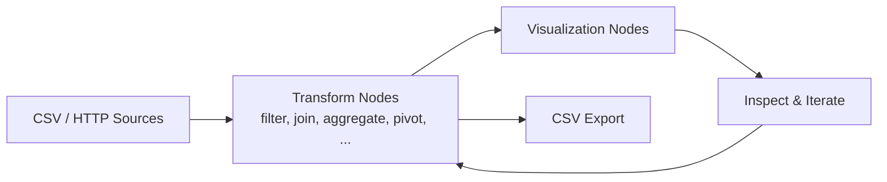

# etl-ui

`etl-ui` is a browser-based ETL canvas for building data pipelines visually. You can connect CSV or HTTP sources, apply transform nodes (such as filter, join, aggregate, and pivot), and send results to visual outputs or CSV download. The app runs fully client-side and autosaves graph state in the browser.

## Features

- Visual node-and-edge canvas for composing ETL flows
- Data source nodes for CSV files and HTTP endpoints
- Transform nodes including filter, join, aggregate, pivot, and more
- Output options for in-app visualization and CSV export
- Local autosave of graph and node settings in IndexedDB
- Built-in templates for loading pre-wired example pipelines

## Data flow

`etl-ui` uses a graph-style ETL pipeline where data moves from sources, through transform steps, into outputs.



Typical workflow:

1. **Ingest** from CSV upload or HTTP endpoint nodes.
2. **Transform** by chaining nodes (filter, join, aggregate, pivot, compute, merge, etc.).
3. **Inspect** intermediate outputs and refine the pipeline.
4. **Output** to visualizations or CSV download.
5. **Persist** graph and node settings locally via IndexedDB autosave.

## Quick start

1. Install dependencies:

   ```bash
   bun install
   ```

2. Start the dev server:

   ```bash
   bun run dev
   ```

3. Open the local URL shown by Vite in your browser.

## Requirements

- [Bun](https://bun.sh/) (lockfile is `bun.lock`)

## Scripts

| Command              | Description                    |
| -------------------- | ------------------------------ |
| `bun install`        | Install dependencies           |
| `bun run dev`        | Start Vite dev server with HMR |
| `bun run build`      | Typecheck and production build |
| `bun run test`       | Vitest suite                   |
| `bun run lint`       | Oxlint with autofix            |
| `bun run lint:check` | Oxlint without writes (CI)     |
| `bun run format`     | Oxfmt                          |
| `bun run preview`    | Preview production build       |

## Persistence

Graphs and node settings are stored locally in **IndexedDB** (database name `etl-ui`). Data does not leave your browser unless you explicitly fetch remote data through HTTP source nodes or export files.

## Import/export and templates

Use **Export** in the toolbar to download the current graph as JSON (same schema as persistence). **Import** replaces the active workspace graph after confirmation and saves to IndexedDB.

**Templates** (toolbar): pick a showcase graph (starter filter chain, aggregates, compute column, transform pipeline, conditional merge, join wiring) and click **Load template** to replace the current canvas with that pre-wired example (same autosave behavior as before).

## Keyboard shortcuts

When focus is not in an input or textarea: **⌘/Ctrl+Z** undo, **⇧⌘Z** / **Ctrl+Y** redo, **⌫** / **Delete** removes selected nodes and edges, **⌘0** / **Ctrl+0** or **F** fits the view.

## CI

GitHub Actions runs install, `lint:check`, tests, and build on push and pull requests (see `.github/workflows/ci.yml`).
